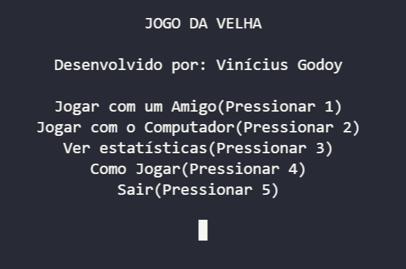

# Jogo da Velha
Um simples jogo da velha que eu usei como uma forma de aprender e praticar **C**, esse é um program que abre no console. Você pode jogar sozinho ou com um amigo, apesar de sozinho ainda estar incompleto. 

**_Obs:_** o jogo não está 100% completo nem é programado com as melhores práticas ou estruturas, escrevi o código dele no começo das minhas aulas de C na faculdade e parei de escrever na época, talvez eu volte a mexer nele ou não. Para jogá-lo é só baixar e rodar o executável.
